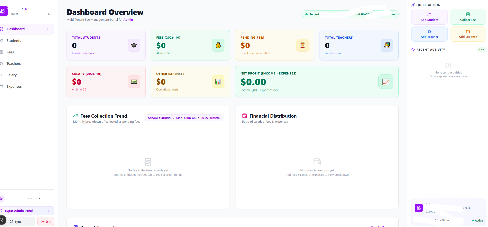
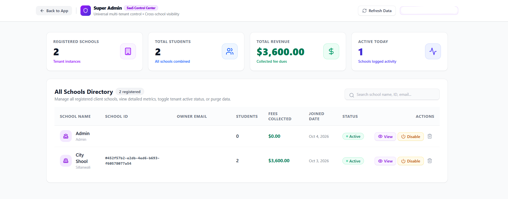

# 🏫 School Management SaaS - Multi-Tenant Portal

A Modern, Fast & Secure SaaS Platform for Schools to manage Fees, Students, Teachers, Salary & Expenses. Built with **Next.js 15 & Supabase.**

### 📸 Live Screenshots

#### 1. Admin Dashboard - Fees & Profit Analytics

#### 2. Super Admin - Control All Schools (SaaS Control Center)

### ✨ Key Features
- 🔐 **Multi-Tenant:** Har school ka data 100% alag
- 💰 **Fees Management:** Monthly Collection, Pending, Trend
- 👑 **Super Admin Panel:** Saare schools, revenue, active status control
- 💵 **Profit System:** Net Profit = Income - (Salary + Expenses)
- 👨‍🎓 Students, 👨‍🏫 Teachers, Salary & Expenses Management
- ⚡ Real-time Activity

### 🛠️ Tech Stack
- **Frontend:** Next.js 15, TypeScript, Tailwind CSS
- **Backend:** Supabase (PostgreSQL)
- **Hosting:** Vercel

### 🚀 Deployment Ready
This project is optimized for Vercel deployment with environment variables.

---
Made with ❤️ by **NexetaDM - Sillanwali**
